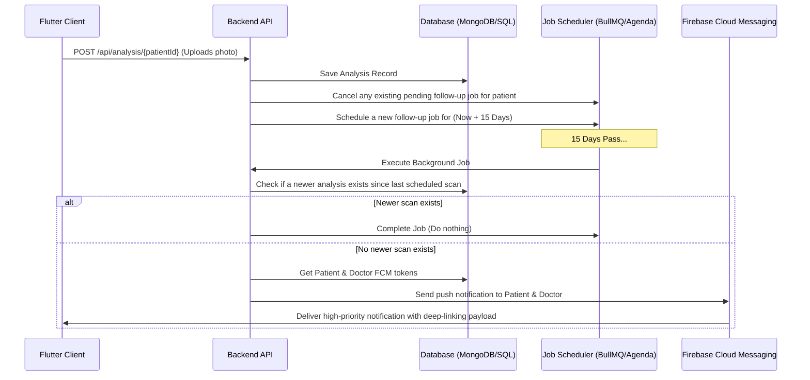

# Backend Specification: 15-Day Skin Scan Follow-up Notifications

This document outlines the database schema, job scheduling mechanism, logic, and API endpoints required to implement the **15-day skin scan follow-up notification** system. 

When a doctor/patient performs an AI skin analysis, the backend must schedule a reminder push notification to be sent exactly **15 days later**, reminding them to capture a follow-up scan to track clinical progress.

---

## 1. High-Level Workflow



---

## 2. Database Schema Updates

### A. Device Tokens Model (`UserToken`)
To send push notifications, the backend must track current active device tokens (Firebase Cloud Messaging) associated with user IDs (both Doctors and Patients).

```typescript
// Mongoose / TypeScript Example
import { Schema, model } from 'mongoose';

const UserTokenSchema = new Schema({
  userId: { type: Schema.Types.ObjectId, required: true, ref: 'User', index: true },
  fcmToken: { type: String, required: true, unique: true },
  deviceType: { type: String, enum: ['android', 'ios'], default: 'android' },
  createdAt: { type: Date, default: Date.now, expires: '30d' } // Auto-expire tokens after 30 days of inactivity
});

export const UserToken = model('UserToken', UserTokenSchema);
```

### B. Scheduled Notification Jobs Collection (`FollowUpJob`)
If not using an out-of-the-box job queue like Redis/BullMQ or Agenda, track scheduled reminders in a MongoDB collection:

```typescript
const FollowUpJobSchema = new Schema({
  patientId: { type: Schema.Types.ObjectId, required: true, ref: 'Patient', index: true },
  doctorId: { type: Schema.Types.ObjectId, required: true, ref: 'User' },
  triggerTime: { type: Date, required: true, index: true },
  triggerAnalysisId: { type: Schema.Types.ObjectId, required: true, ref: 'Analysis' }, // The analysis that created this schedule
  status: { type: String, enum: ['pending', 'executed', 'cancelled'], default: 'pending' },
  createdAt: { type: Date, default: Date.now }
});

export const FollowUpJob = model('FollowUpJob', FollowUpJobSchema);
```

---

## 3. Job Schedulers & Schedulers Service

We recommend **Agenda** (MongoDB-backed) or **BullMQ** (Redis-backed) for reliable scheduling. Below is the reference logic for scheduling the job upon analysis completion:

### When to Schedule / Reschedule the Job
Every time the endpoint `POST /api/analysis/:patientId` is called successfully:
1. **Cancel** any pending reminders for the patient.
2. **Schedule** a new reminder exactly 15 days in the future.

### NodeJS Integration Example (Express Service Controller)

```javascript
import { FollowUpJob } from '../models/follow_up_job.model';
import { UserToken } from '../models/user_token.model';
import admin from 'firebase-admin'; // FCM Admin SDK

/**
 * Main Service logic executed when POST /api/analysis/:patientId succeeds
 */
export async function scheduleFollowUpNotification(patient, analysis) {
  const patientId = patient._id;
  const doctorId = patient.doctorId || analysis.doctorId;

  // 1. Cancel previous pending reminders for this patient
  await FollowUpJob.updateMany(
    { patientId, status: 'pending' },
    { $set: { status: 'cancelled' } }
  );

  // 2. Calculate execution time (Now + 15 Days)
  const triggerTime = new Date();
  triggerTime.setDate(triggerTime.getDate() + 15); // Adjust to 15 days

  // 3. Save new job in Database
  await FollowUpJob.create({
    patientId,
    doctorId,
    triggerTime,
    triggerAnalysisId: analysis._id,
    status: 'pending'
  });
}
```

---

## 4. Background Job Execution Worker

A background cron or worker (running e.g. every hour or utilizing a scheduler queue) polls for pending jobs where `triggerTime <= new Date()`.

### Execution Logic Check:
Before triggering the FCM payload, verify if a newer scan was uploaded *after* the job's triggering analysis to avoid redundant reminders:

```javascript
export async function processScheduledFollowUps() {
  const now = new Date();
  
  // Fetch all pending follow-up jobs that are due
  const dueJobs = await FollowUpJob.find({
    status: 'pending',
    triggerTime: { $lte: now }
  }).populate('patientId');

  for (const job of dueJobs) {
    try {
      const patient = job.patientId;
      
      // 1. Double check: Has a newer scan been uploaded since this job was created?
      const newerAnalysis = await Analysis.findOne({
        patientId: job.patientId,
        createdAt: { $gt: job.createdAt }
      });

      if (newerAnalysis) {
        // A newer scan exists, mark the job completed and skip notifying
        job.status = 'executed';
        await job.save();
        continue;
      }

      // 2. Fetch FCM Tokens for Patient & Supervising Doctor
      const patientTokens = await UserToken.find({ userId: patient.userId });
      const doctorTokens = await UserToken.find({ userId: job.doctorId });

      // 3. Define Notification Message Payload with custom Deep-Linking values
      const patientNotificationPayload = {
        notification: {
          title: "Time for your skin follow-up scan! 📸",
          body: `It has been 15 days since your last scan. Let's capture a new photo to check your progress!`
        },
        data: {
          type: "followup",
          patientId: patient._id.toString(),
          diagnosis: patient.diagnosis || "Skin Condition",
          patientName: patient.name || "Patient"
        }
      };

      const doctorNotificationPayload = {
        notification: {
          title: `Follow-up scan due: ${patient.name}`,
          body: `${patient.name} is due for their 15-day skin follow-up analysis.`
        },
        data: {
          type: "doctor_followup",
          patientId: patient._id.toString(),
          patientName: patient.name || "Patient"
        }
      };

      // 4. Send Push Notifications via FCM Admin SDK
      const sendPromises = [];

      if (patientTokens.length > 0) {
        const tokens = patientTokens.map(t => t.fcmToken);
        sendPromises.push(admin.messaging().sendToDevice(tokens, patientNotificationPayload));
      }

      if (doctorTokens.length > 0) {
        const tokens = doctorTokens.map(t => t.fcmToken);
        sendPromises.push(admin.messaging().sendToDevice(tokens, doctorNotificationPayload));
      }

      await Promise.all(sendPromises);

      // 5. Update Job Status
      job.status = 'executed';
      await job.save();

      console.log(`[Follow-Up] Successfully sent 15-day notifications for patient ${patient.name}`);
    } catch (err) {
      console.error(`[Follow-Up] Error executing job ${job._id}:`, err);
    }
  }
}
```

---

## 5. Flutter Client Deep-Linking Support
The backend's notification payloads specify a `data` parameter. The Flutter application maps this payload to routes:

- **Type**: `followup` -> Navigates to `UploadAnalyzeScreen`
- **Params**:
  - `patientId`: String
  - `patientName`: String
  - `diagnosis`: String

This launches the camera upload interface immediately when tapped, creating an extremely cohesive and professional clinical workflow!
